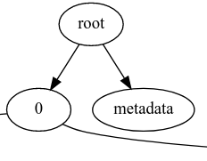
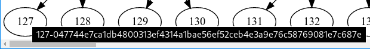
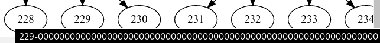

# EIP-2926: Chunk-Based Code Merkleization Example

This repository contains:

- [merkleize.py](https://github.com/hugo-dc/code-chunks/blob/master/merkleize.py):
based on a script shared by @vbuterin. This script contains the following functions:
    - `chunkify`: Takes a bytecode and return chunks of 32 bytes each.
    - `treefy`: takes 32 byte chunks and the total byte code length, and returns a binary tree containing all the chunks.
    - `next_power_of_2`: This function is used to calculate the total number of leafs in the binary tree. For example:
        - For 2 chunks, next power of 2 is: `2`, the binary tree will contain `2` leafs in total.
        - For 3 chunks, next power of 2 is: `4`, the binary tree will contain `4` leafs in total.
        - For 5 chunks, next power of 2 is: `8`, the binary tree will contain `8` leafs in total.
        - For 6 chunks, next power of 2 is: `8`, the binary tree will contain `8` leafs in total.
        - For 9 chunks, next power of 2 is: `16`, the binary tree will contain `16` leafs in total.
        - For 513 chunks, next power of 2 is: `1024`, the binary tree will contain `1024` leafs in total.
    - `sha3_sha256`: Uses `hashlib.sha3_256()` to hash the data.
- [treeviz.py](https://github.com/hugo-dc/code-chunks/blob/master/treeviz.py): Contains a function `generate_tree`, which receives the tree generated by `merkleize.py` and generates a [Graphviz](https://graphviz.readthedocs.io/en/stable/) tree visualization.
- [examples.py](https://github.com/hugo-dc/code-chunks/blob/master/examples.py): this script makes use of `merkleize.py` and `treeviz.py`, in order to generate the trees corresponding to the contracts in the `bytecodes` directory, this directory contains some examples of contracts displayed on [etherscan.io](https://etherscan.io/tokens):
    - BAT
    - LINK
    - MKR
    - OMG
    - USDC
    - LEND
    - WBTC
    - YFI
    - USDT

## Executing

- Install [Graphviz](https://graphviz.org/download/).
- Install the `graphviz` python library:

    pip install graphviz
    
After that we can execute the `example.py` script which will generate the SVG
files in the `render/` directory.

## Results

The result contains a Binary tree containing all the chunks, after the tree is
generated, a root is calculated based on the chunks binary tree root (0-index
element) and the metadata:

The metadata corresponds to the total bytecode length as a Big Endian 32 bit
number.

The leafs of the tree corresponds to `hash(chunk + code_start)`. Except for the
empty (zero) leafs which are generated to fill the binary tree.

If you move your mouse over a leaf it will show you the `chunk` + `code_start`
hash, or the empty value (zeros):

These are the results after executing the script (click on the image to see the
full size):

### BAT

- **Total chunks:** 102
- **Total leafs:** 128
- **Total nodes:** 256

### LINK

- **Total chunks:** 98
- **Total leafs:** 128
- **Total nodes:** 256

### MKR

- **Total chunks:** 105
- **Total leafs:** 128
- **Total nodes:** 256

### OMG

- **Total chunks:** 122
- **Total leafs:** 128
- **Total nodes:** 256

### USDC

- **Total chunks:** 68
- **Total leafs:** 128
- **Total nodes:** 256

### DAI

- **Total chunks:** 247
- **Total leafs:** 256
- **Total nodes:** 512

### LEND

- **Total chunks:** 215
- **Total leafs:** 256
- **Total nodes:** 512

### WBTC

- **Total chunks:** 143
- **Total leafs:** 256
- **Total nodes:** 512

### YFI

- **Total chunks:** 200
- **Total leafs:** 256
- **Total nodes:** 512

### USDT

- **Total chunks:** 513
- **Total leafs:** 1024
- **Total nodes:** 2048

[Click here to see the
tree](https://raw.githubusercontent.com/hugo-dc/code-chunks/master/render/usdt.dot.svg)